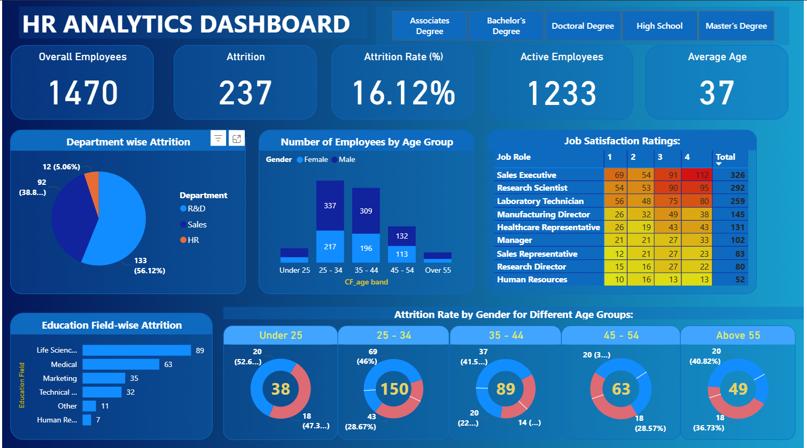

# HR Attrition Analysis – Power BI Dashboard

## 📌 Project Overview
This project analyzes employee attrition trends to help HR teams understand **who is leaving, from where, and why**.  
It uses **Power BI** for data visualization and interactive analysis.

## 🔍 Problem Statement
High employee turnover impacts costs, productivity, and morale.  
This dashboard provides insights to design targeted retention strategies.

## 📊 Key Insights
- Attrition by **Education Field**
- Attrition by **Gender & Age Group**
- Attrition by **Department**
- KPIs: Total Employees, Attrition Count, Attrition Rate, Average Age
- Job Satisfaction Trends

## 🛠 Tools & Skills
- Microsoft Power BI Desktop  
- DAX  
- Data Modeling  
- Data Visualization

## 📂 Files in this Repository
- `HR_Attrition_Dashboard.pbix` – Power BI project file
- `dataset.csv` – Sample dataset
- `images/` – Dashboard screenshots
- `README.md` – Project documentation

## 📸 Dashboard Preview

## 🚀 How to View
1. Download the `.pbix` file from this repository.
2. Open in **Power BI Desktop**.

---
**Author:** Sachin  
**Skills:** Power BI · DAX · Data Analysis · Data Visualization
